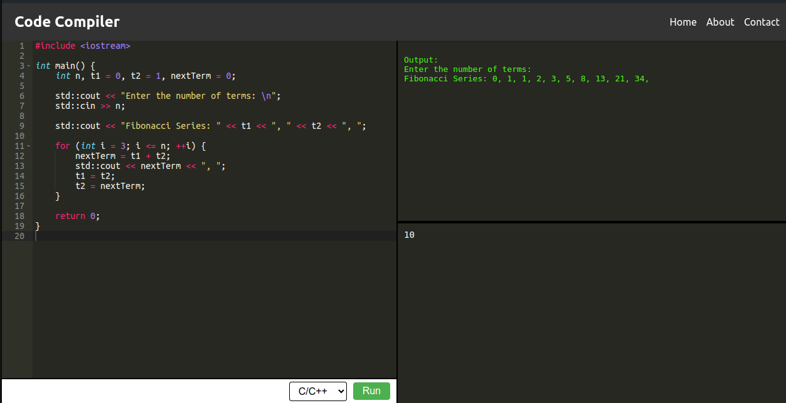
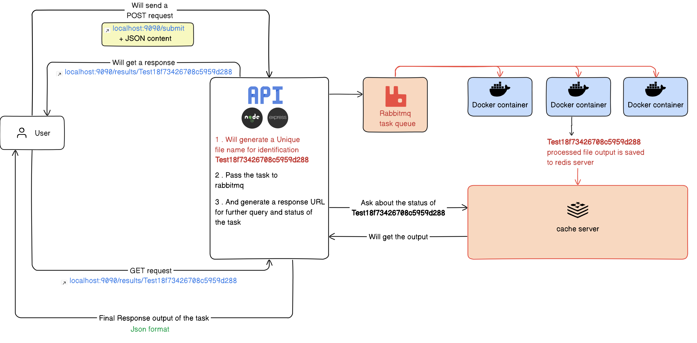

# Code-Execution-Engine
The **Code-Execution-Engine** is a Docker-based API for securely running code snippets in various languages. Clone the repo, build and run the Docker containers, and use tools like Postman to test code. It supports multiple languages and provides detailed execution results.
**Leave a star if you like it!** 😀

<br>

If you need a simple frontend you can check https://github.com/NaheedRayan/online-code-editor

## FrontEnd

  

## BackEnd Architecture

  


<br>

## Running the API

### Prerequisites

Ensure you have Docker and Docker Compose installed on your system.

### Step 1: Clone the Repository

```bash
git clone <repository-url>
cd <repository-folder>
```

### Step 2: Build the Docker Images

```bash
sudo docker-compose build
```

### Step 3: Run the Docker Containers

```bash
sudo docker-compose up
```

### Step 4: Test the API

#### Using cURL:

Ping the server to ensure it's running:

```bash
curl http://localhost:8080/
```

You should receive a response: `Hello from Titan-Engine` with status code `200`.

#### Using a Browser:

Open your browser and navigate to: `http://localhost:8080/`

You should see the same response: `Hello from Titan-Engine`.

#### Using Postman (Recommended):

Send a POST request to `http://localhost:8080/submit` with the following JSON body:

```json
{
    "src": "\n\n#include<bits/stdc++.h>\n\nusing namespace std ;\n\nint main()\n{\n    int a ;\n    cin >> a ;\n\n    cout << \"The first number is \" << a << endl ;\n    \n    int b ;\n    cin >> b ;\n    \n    cout << \"The second number is \" << b << endl ;\n\n    cout << \"Hello from cpp\" <<endl ;\n\n    // while(1)\n    // {\n    //     cout << 1 << endl ;\n    // }\n    return 0;\n}\n\n",
    "stdin": "48\n95",
    "lang": "cpp",
    "timeout": "5"
}
```

You will receive a response like:

```
http://localhost:8080/results/Test646d62525e1b09171058
```

You can then use this URL in Postman or your browser to view the execution result.


## Yay! It's working 😎👌👏

<br>

### Monitoring Logs
To view the logs for the Docker containers, you can use the following commands:

View the Last 50 Lines of Logs with Timestamps
```bash
docker-compose logs -ft --tail 50
```
View the Last 50 Lines of Logs without Timestamps
```bash
docker-compose logs -f --tail 50
```
Clearing Docker Resources
To clear unused Docker resources (dangling images, stopped containers, etc.) and free up space, run:

```bash
docker system prune
```
This command will remove all unused data, so use it with caution.

<br>

## Understanding POST Requests and Responses

### POST Request


- **`src`:** Contains the script in raw format.
- **`stdin`:** Contains the inputs in raw format.
- **`lang`:** The programming language of the script.(`c` , `cpp` , `java` , `python3` , `openJDK-8`)
- **`timeout`:** The maximum time (in seconds) the script is allowed to run. (Max 5 sec)


### POST Request Response

The API will respond with a URL like:

```
http://localhost:8080/results/Test646d62525e1b09171058
```

Navigate to this URL to view the result.


- **`output`:** The output of the script.
- **`status`:** Status of the execution (e.g., Successful, Failed).
- **`stderr`:** Any errors encountered during execution.
- **`submission_id`:** A unique ID for the submission.

## Status Codes

Here are the different status codes you may encounter:

- **`Invalid Request`:** The request was not properly formatted or required fields were missing.
- **`Queued`:** The request is waiting to be processed.
- **`Processing`:** The script is currently being executed.
- **`Runtime Error`:** An error occurred during execution on the worker nodes.
- **`Failed`:** The script failed due to a compilation or runtime error.
- **`Successful`:** The script executed successfully.

<br>

## Ports

The Docker Compose setup exposes two ports:

- **Port 8080:** Used for debugging (HTTP).
- **Port 9090:** Uses a self-signed SSL certificate (HTTPS).

<br>

# The End

Congratulations on setting up and running the Code-Execution-Engine! 🎉

