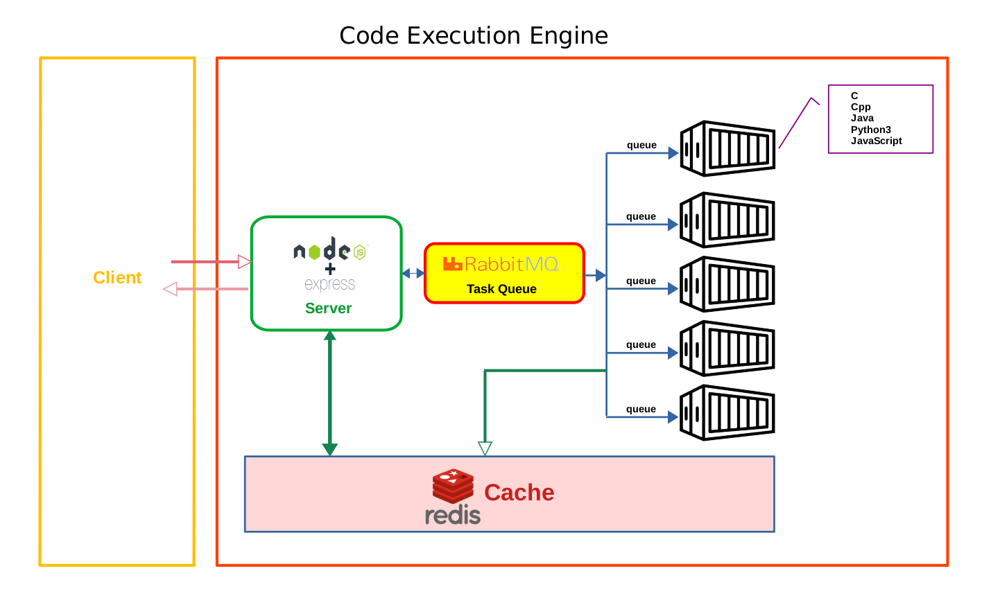
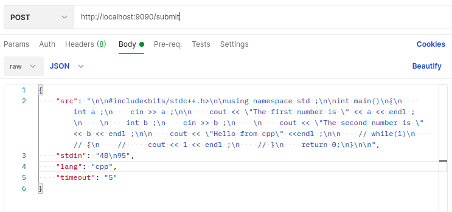

# code-execution-engine
An API which executes codes in a sandbox environment 🙀🤯. 
## Leave a star if U like it 😀
<br>

# Architecture



<br>

# Running the API
<br>

### Prerequisites
    Docker and docker compose should be installed in the system

``Step 1 :``
    
    Clone the repo

``Step 2 :`` building the images

    sudo docker-compose build

``Step 3 :`` running the images

    sudo docker-compose up

``Step 4 :`` Testing if its working 

If its running on localhost then ping the server using 

- On terminal:
        
        curl http://localhost:9090/

    We will get a response saying ```Hello from Titan-Engine``` with status code ``200``.

- On browser :

    paste the url ``http://localhost:9090/`` and see the response.

- On Postman : ``(recommended)``

    Sending a json post request to ``http://localhost:9090/submit``

    ### It is a c++ script which takes 2 input and print's it.

    ```json
    {
    "src": "\n\n#include<bits/stdc++.h>\n\nusing namespace std ;\n\nint main()\n{\n    int a ;\n    cin >> a ;\n\n    cout << \"The first number is \" << a << endl ;\n    \n    int b ;\n    cin >> b ;\n    \n    cout << \"The second number is \" << b << endl ;\n\n    cout << \"Hello from cpp\" <<endl ;\n\n    // while(1)\n    // {\n    //     cout << 1 << endl ;\n    // }\n    return 0;\n}\n\n",
    "stdin": "48\n95",
    "lang": "cpp",
    "timeout": "5"
    }
    ```
    <br>
    
    
    
    we will get a response like

        http://localhost:900/results/Test646d62525e1b09171058


    Run this response in postman or browser

    


<br>

## Yay Its working 😎😎👌👏

<br>
<br>


# Understanding post request and responses


## Post


```src``` contains the scripts in raw formate.

```stdin``` contains the inputs in raw formate.

```lang``` the programming language.

```timeout``` number of seconds the program will run.(Max 5 sec)


<br>
<br>

## Response

we will get a response like

    http://localhost:900/results/Test646d62525e1b09171058

Run this response in postman or browser


```output``` The output of the script

```status``` status of the output

```stderr``` error in code

```submission_id``` the unique submission id

<br>
<br>
<br>


## Different types of status:
<br>


    "status": "Invalid Request"

If the field in post request is empty then it will show invalid request

<br>

    "status":"Queued"

If the request is in waiting stage i.e. in queue.

<br>

    "status":"Processing"

If the script is running

<br>

    "status":"Runtime Error"
    
If the exec command fails for some reason in worker nodes

<br>

    "status":"Failed"

Causes due to compilation error or runtime error.

<br>

    "status":"Successful"

Everything is OK


<br>
<br>
<br>

# PORT 8080 and PORT 9090

## The docker-compose exposes 2 ports

**https**  The port 8080 uses self signed ssl certificate.

**http**  The port 9090 can be used for debugging.     

<br>
<br>
<br>
<br>


# The End